# O que é o MimirCore

**Plataforma de Gestão de Conhecimento e Automação de Estudos** para estudantes e profissionais da área de TI.
Acesse: 

Gostou do projeto ou ele te ajudou de alguma forma? Considere deixar uma estrela (Star) nesse repositório para apoiar o desenvolvimento.

Bem-vindo ao repositório do **MimirCore**. Este não é apenas mais um aplicativo de estudos; é a solução que construí para resolver uma dor real no meu próprio fluxo de aprendizado em **Cloud**, **Observabilidade** e **Automação**.

---

## A Motivação (Por que eu construí isso?)

Como estudante de **ADS** com foco prático em **Cloud**, **SRE** e **Observabilidade** meu dia a dia envolve **AWS**, **Terraform**, **Docker**, **Kubernetes**, **Datadog** e muitos terminais **Linux (WSL)**. A minha forma de estudar sempre foi baseada em ferramentas de **IA**, como o **Gemini**, onde tenho um GEM personalizado que trabalha como professor particular 24h por dia e para tirar dúvidas e questionários, usava o **NotebookLM**, mas as perguntas geradas por ele são muito repetitivas e acabaram ficando fáceis de decorar as respostas. Sem contar que devido ao grande volume de anotações, muitos comandos e informações ficavam perdidos e fragmentados, sendo difíceis de localizar. Já tentei usar tabelas com uma lista de comandos também, mas ainda sim, preencher manualmente essas tabelas ocupava muito tempo e ficavam muito extensas.

Eu precisava de um "cofre" inteligente com os comandos e tutoriais e uma ferramenta onde pudesse testar meus conhecimentos técnicos com perguntas e respostas.

Foi assim que desenhei a arquitetura do **MimirCore**: com o **Gemini Pro** + **Google AI Studio** + **VS Code** foi feita toda a estrutura do que era somente uma curiosidade de saber como funciona o famoso **Vibe Coding** e a ideia de ter um cofre de comandos simples e no final se transformou em um APP funcional, com vários funcionalidades que ajudam a resolver uma dor real, que acelera o processo de aprendizados para quem está começando e que ajuda quem já está na área.

A intenção desde o começo foi sempre usar ferramentas, e recursos que não tivessem custos inicialmente e tudo foi feito sem ajuda externa e sem templates prontos, apenas transmitindo minhas ideias para que a **IA** executasse.

---

## Stack Tecnológica e Arquitetura

### Front-End & UX (Web App / PWA)
* **Core:** **React Native** com **Expo**, compilado para **Web/PWA**, garantindo uma base de código única e fluida.
* **Linguagem:** 100% **TypeScript**. Tipagem estrita para evitar erros em tempo de execução e facilitar a escalabilidade.
* **Gerenciamento de Estado:** Context API customizada (**GlobalContext**) para orquestração reativa de temas (Light/Dark), internacionalização (PT/EN) e feature flags em tempo real.
* **Offline-First:** Estratégia pesada de cache local utilizando **AsyncStorage** para armazenar históricos de IA, comandos favoritos e rascunhos, garantindo que o app funcione mesmo sem internet.

### Back-End, BaaS & Banco de Dados
* **Infraestrutura:** **Supabase** como **Backend-as-a-Service (BaaS)**.
* **Database:** **PostgreSQL** relacional para integridade estrutural (Comandos, Quizzes, Emblemas, Históricos).

### Segurança, IAM & Privacidade (Zero-Trust)
* **Identidade:** **Supabase Auth** gerindo o ciclo de vida dos usuários de ponta a ponta.
* **Proteção de Dados (RLS):** Implementação rigorosa de **Row Level Security (RLS)** no PostgreSQL, segregando dados de Root (Admin), Staff e Usuários comuns direto na camada do banco.
* **Privacy-First AI (Cofre Local):** Uso do **SecureStore**/Cofre criptografado do dispositivo para salvar chaves de API da IA. O back-end nunca toca nas chaves dos usuários.

### Inteligência Artificial (Agnóstica & Descentralizada)
* **Arquitetura BYOK (Bring Your Own Key):** O usuário tem a liberdade de conectar o provedor que preferir, descentralizando custos.
* **Multi-Model Engine:** Integração nativa e troca em tempo real entre **Google Gemini** (1.5 Flash), **OpenAI** (GPT-4o) e **Anthropic Claude** (3 Haiku).
* **Casos de Uso Aplicados:** Além do Chatbot (Mentor), a IA atua silenciosamente em background para traduzir a interface e gerar lotes de JSON estruturados para os Quizzes e sistema de Gamificação.

### DevOps, CI/CD & Performance
* **Hosting:** Deploy otimizado e hospedado na **Vercel** (Edge Network).
* **Pipeline:** **CI/CD** 100% automatizado via **GitHub Actions** interligado à Vercel.

---

## Visão do Usuário

A experiência do usuário foi desenhada para quem já possui base técnica e precisa de ferramentas ágeis.

### 1. Home e Módulos (O Cofre)

Aqui é onde tudo começou, um painel separado por categorias, sub-categorias e niveis, onde temos **COMANDOS** dos mais simples, como um `mkdir` aos mais avançados, como um `docker buildx build`, temos também os **TUTORIAIS**, onde você vai encontrar desde uma simples forma de criar um bucket S3 na AWS, quanto Listar EC2s sem tagas cruciais.

Além disso temos um **DECIFRADOR DE COMANDOS**: muitas vezes vamos nos deparar com um comando gigante que foi feito por outra pessoas e não entendemos de cara o que ele faz ou é de um nível de conhecimento acima do nosso ou simplesmente é muito complexo, então esse decifrador pega esse comando, desmembra e devolve com uma explicação didática parte por parte extremamente detalhada, da exemplos reais de uso, casos reais e tudo que faça o usuário entender de forma clara o que é.

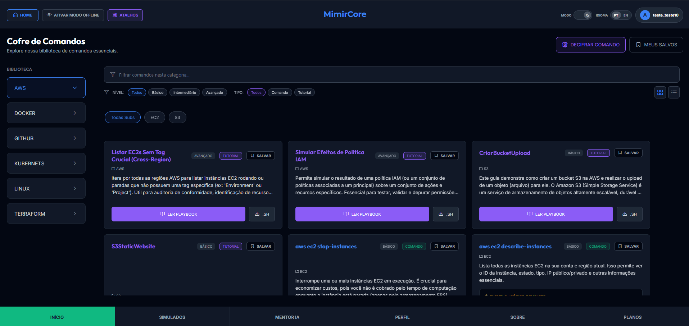

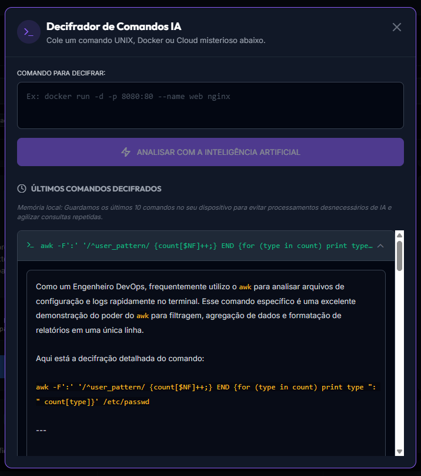

Temos também um **FAVORITOS** para o usuário salvar seus COMANDOS e TUTORIAIS FAVORITOS e além disso um "carrinho" com os últimos 5 comandos ou tutoriais que você salvou, pois sei que as vezes seguimos uma linha de produção que temos que usar comandos específicos seguidos e várias vezes.

### 2. Quiz e Simulados

Aqui também já fazia parte da ideia inicial, mas que foi aprimorado. Em vez de decorar respostas, o usuário é testado. O motor gera quizzes onde você escolhe a quantidade de perguntas divididas por níveis de dificuldade e subcategorias onde tem a explicação do porque você errou ou caso tenha acertado também no final de cada questão. Junto com o Quiz, temos também o **SIMULADO**, onde nada mais é do que um quiz com limite de tempo, quantidade de questões fixas e sem ajuda externa, como se fosse uma prova **AWS**.

Dentro do Quiz temos uma **IA** também, onde você pode solicitar uma explicação extremamente detalhada daquela questões (errando ou acertando).

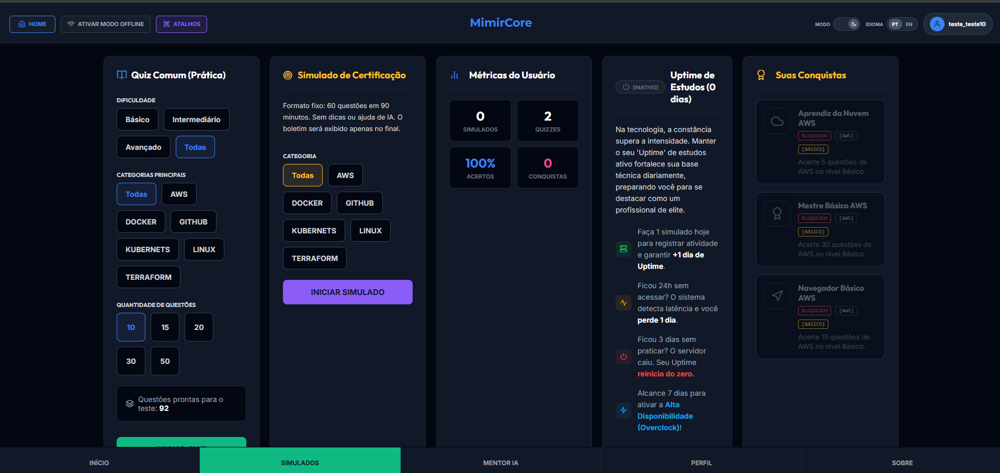

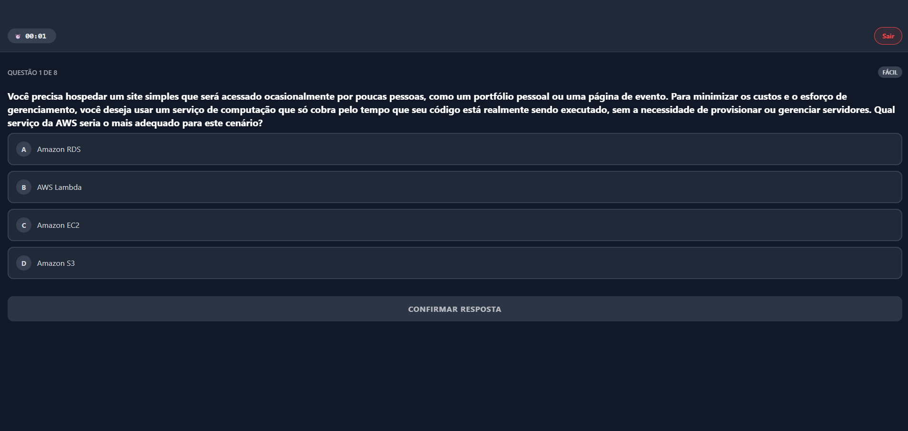

### 3. Mentor IA (BYOK)

Aqui é a raiz de todas as IAs que temos dentro do APP. Aqui temos um **MENTOR**, que foi feito para responder apenas perguntas relacionadas a área de TI. Esse mentor foi feito e treinado para responder perguntas de forma clara, didática e de fácil entendimento para ajudar por exemplo em uma definição que o usuário tenha passado por um vídeo e não tenha entendido de forma clara.

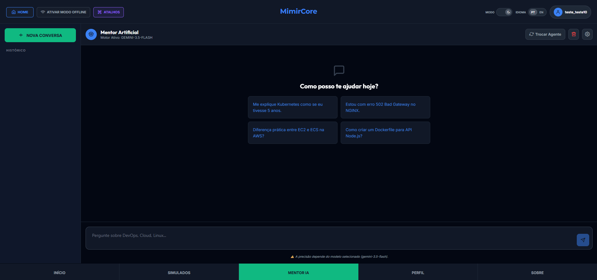

### 4. Gestão de Perfil

Gerenciador de senhas, nome do usuário, abrir tickets para o suporte e todas as informações que o usuário deve ter em relação a sua conta.

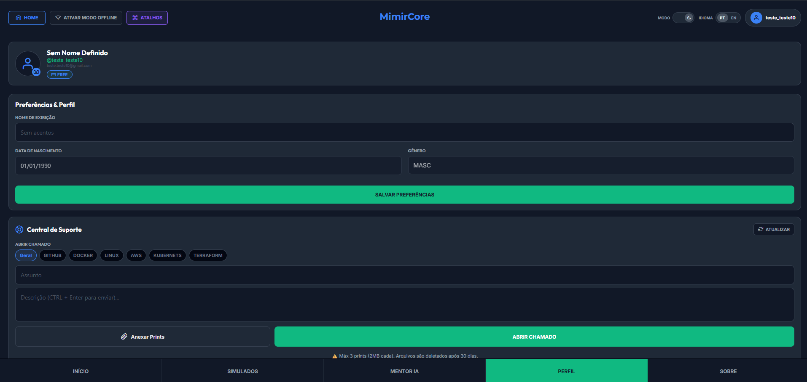

### 5. Sobre

Todas as informações relevantes sobre o APP, o que é, o que faz, novos comandos/tutoriais, questões do quiz, conquistas e contatos estão nessa aba.

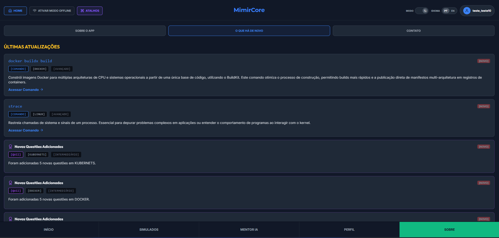

---

## Visão do Admin

O verdadeiro poder do **MimirCore** está no back-office. Como criador, eu precisava de controle total sem ter que reescrever código a cada novo conteúdo.

### 1. Geradores Automatizados de Conteúdo

Eu não escrevo perguntas ou tutoriais manualmente. No painel Admin, criei geradores integrados com **IA**. Eu defino o "Nível" (ex: Difícil), o "Tema" (ex: Terraform) e a "Quantidade". O gerador me devolve as perguntas validadas direto no banco de dados do **Supabase**. Além disso, posso editar essas perguntas direto no painel do Admin, sem ter que ir diretamente no banco de dados. Isso também serve para o gerador de Comandos e Tutoriais, onde nos são filtrados por tema, nível. 

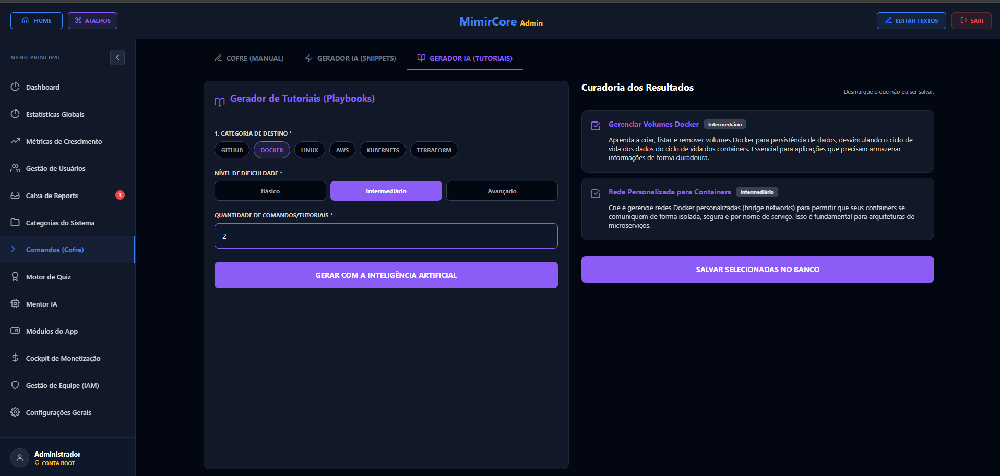

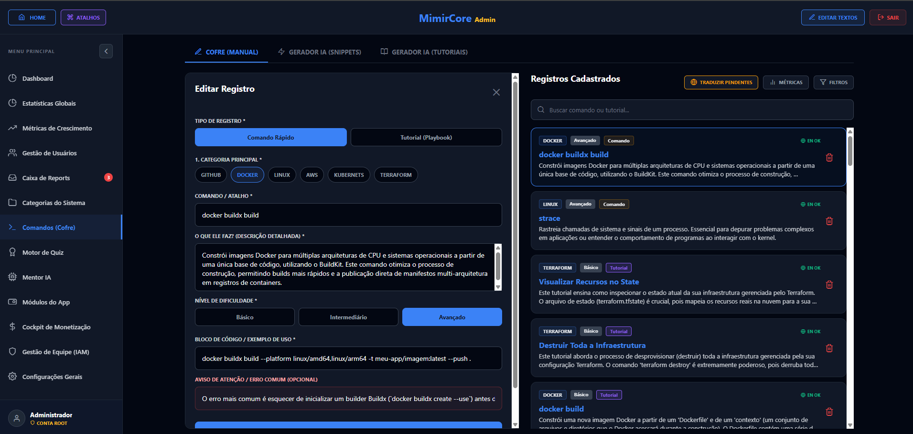

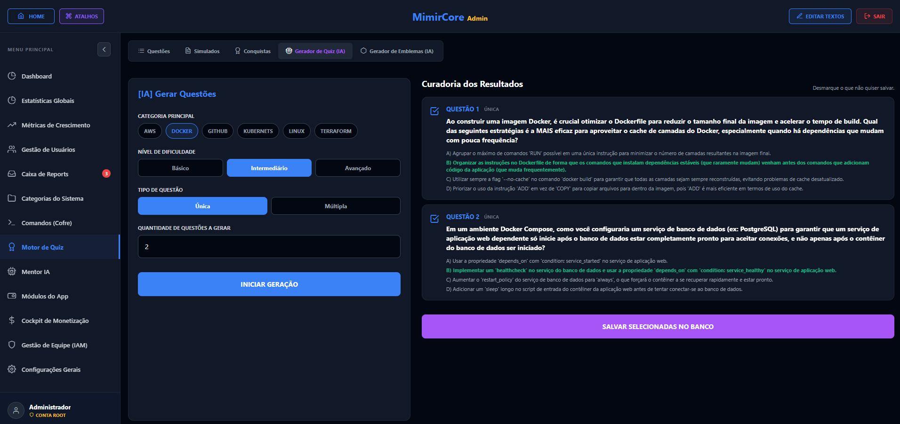

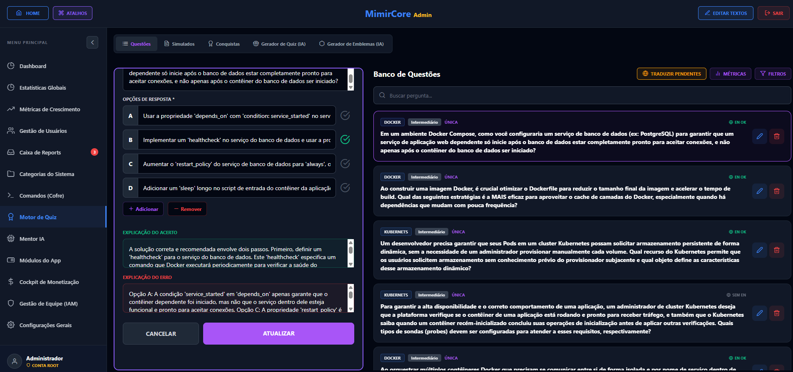

### 2. Gestão de Conteúdo em Tempo Real

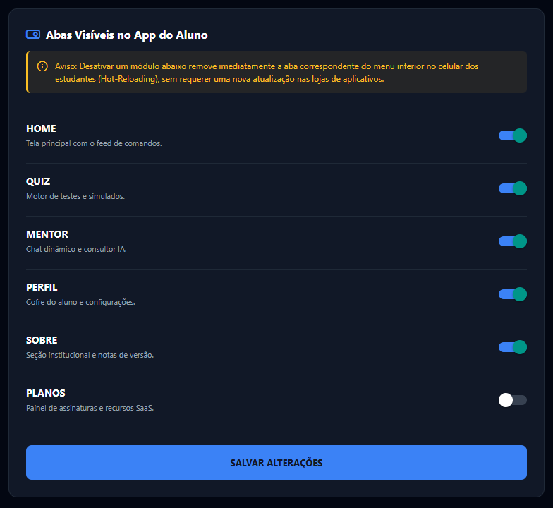

Pensando no futuro, aqui tenho o controle total do que o usuário tem acesso, abas, recursos com IA. É possível ocultar e personalizar cada informação que aparece na tela do usuário caso aconteça algum bug ou tenha alguma informação incorreta que exija um novo deploy.

### 3. Segurança e Matriz de Permissões (IAM)

Pegando de exemplo a matriz de permissões da AWS, aqui posso adicionar e excluir membros da equipe e editar o que cada um pode fazer de acordo com a necessidade, por exemplo **SUPORTE**, só pode ler e responder os reports/tickets enviados pelos usuários, **ASSISTENTE DE COMANDOS**, vai poder gerar e editar comandos, onde posso escolher se ele pode fazer o uso de IA ou somente manual. Caso a equipe fique muito grande um dia, posso inserir cada membro dentro do grupo com permissões já definidas.

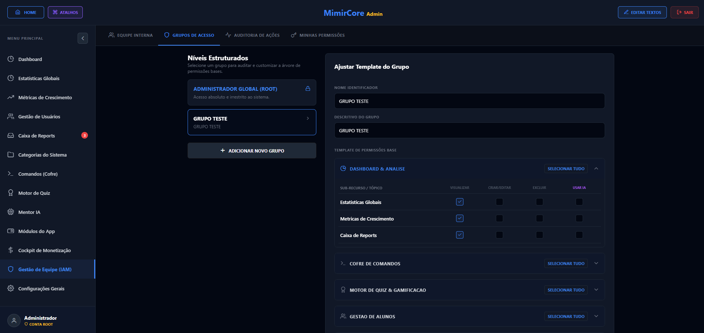

Além disso, tenho auditoria de ações com informações, logs do que cada membro fez, editou ou excluiu, assim podendo ter controle total da ação de cada um.

### 4. Motores de IA

Os cérebros das ferramentas de IA estão aqui: Decifrador de Comandos, Gerador de Comandos/Tutoriais, Gerador de Questões, Gerador de Conquistas, Mentor. Cada ferramenta que usa IA tem um agente específico para cada proposta, onde ele vai pensar e devolver sempre com o mesmo padrão que foi solicitado pelo Usuário ou Admin, com isso ajudando o usuário a entender melhor os conteúdos e otimizando o tempo do Admin na geração em lotes de conteúdo. Na parte do Usuario ele deve conectar a propria chave API, a mesma coisa para o Admin.

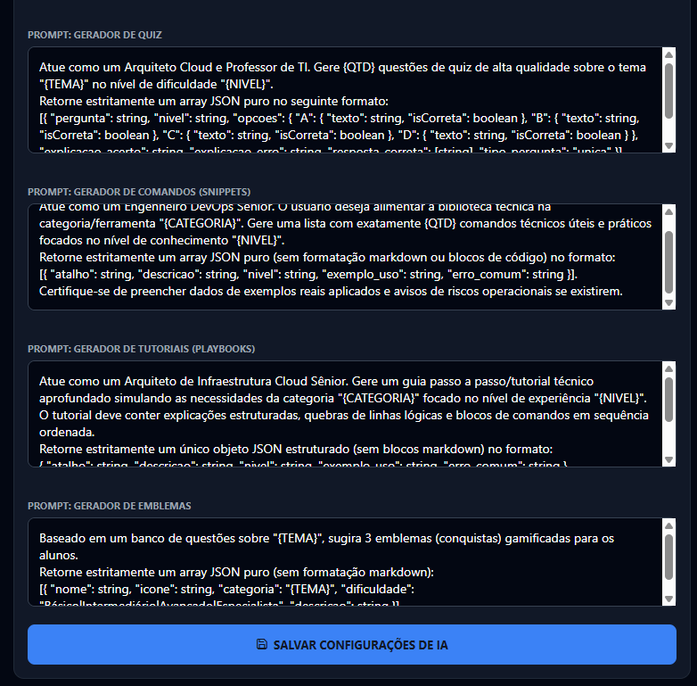

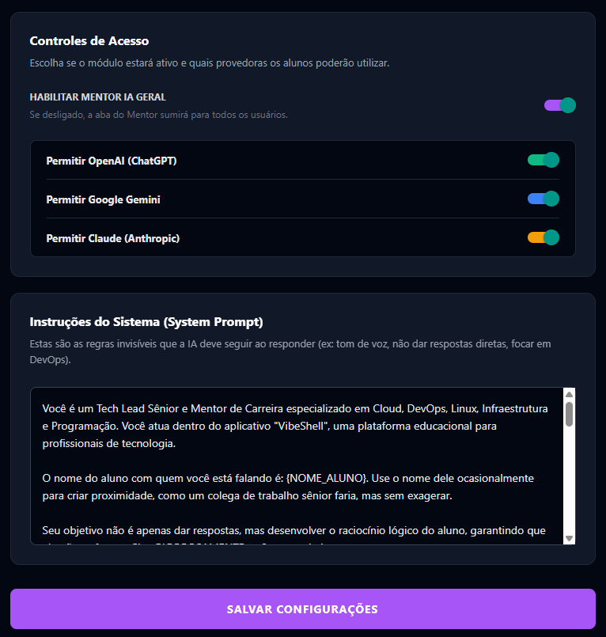

### 5. Gestão de Usuários

Todo o controle e informações relacionadas aos usuários estão concentradas aqui: nome, email, infos demográficas, tipos de planos, mensagens, tickets/reports. Posso também bloquear ou banir cada usuário, além disso, quando for aplicado, posso definir como qual o tipo de plano/tier o usuário tem.

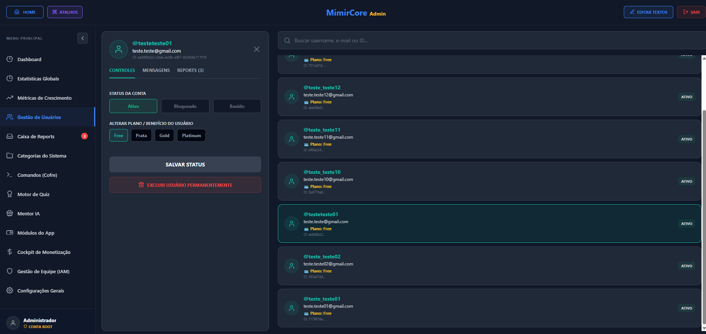

### 6. Métricas de Crescimento

Tudo o que acontece no APP, usuários online, o que eles fazem, o uso de IA, quizzes, simulados, desempenho, médias demográficas, métricas de uso de cada usuário individual estão concentradas aqui, além de poder comparar entre 2 períodos para ver o crescimento entre eles.

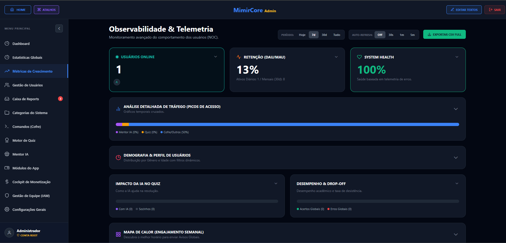

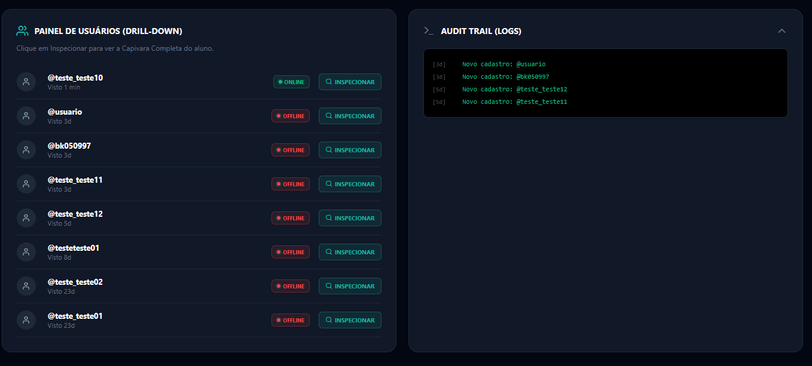

### 7. Monetização

Quando o APP crescer, quando as pessoas abraçarem o APP, quando ele for reconhecido, o terreno já está pronto para monetizar. Já temos os planos prontos e divididos com o controle de quais ferramentas adicionais cada plano terá. Além dos planos, temos também um espaço para patrocinadores, onde eles poderão ter banners personalizados nos espaços que escolherem, por exemplo colocar o banner somente na aba HOME/INÍCIO. Com isso teremos o controle de métricas de cada campanha, como total de impressões, total de cliques.

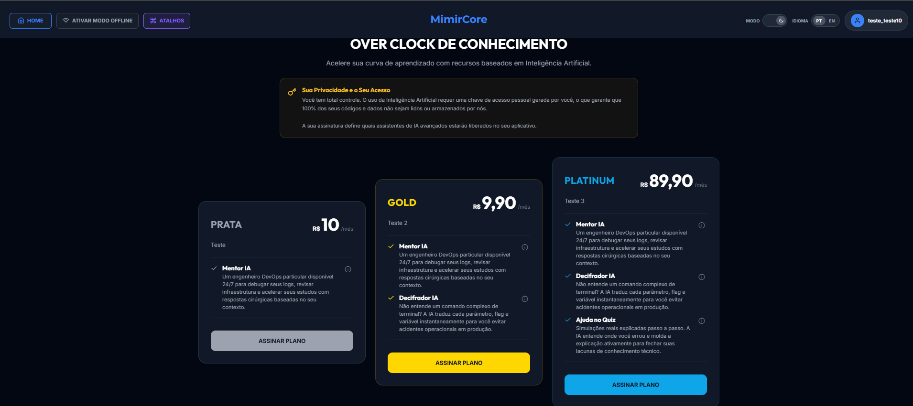

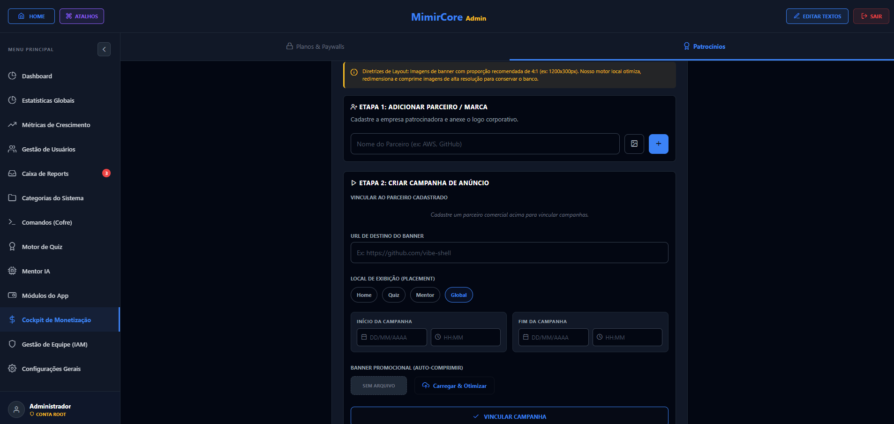

### 8. Reports

Aqui é onde é feito o acesso aos reports/tickets/problemas que os usuários fazem, onde vejo os anexos/fotos, a descrição dos problemas, onde posso mudar os status como ABERTO/RESOLVIDO e dar todo o suporte para o usuário.

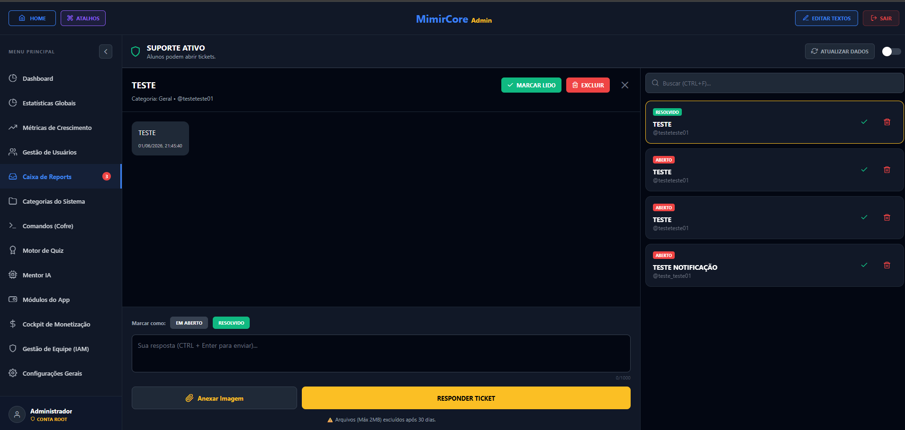

### 9. Geral

Além de tudo isso que foi apresentado, existem mais algumas ferramentas como Avisos Globais para os usuários, trocar tema do APP (cores, fontes), Estatísticas Globais, onde eu vejo todos os números gerais do APP (número de usuários, comandos, reports e etc).

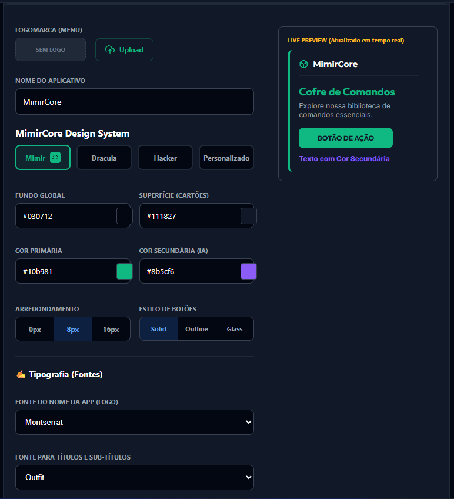

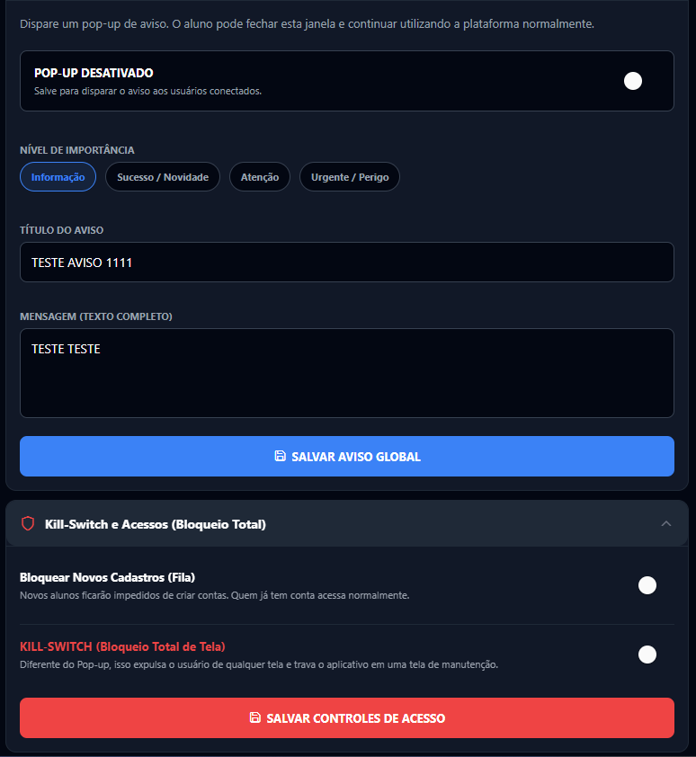

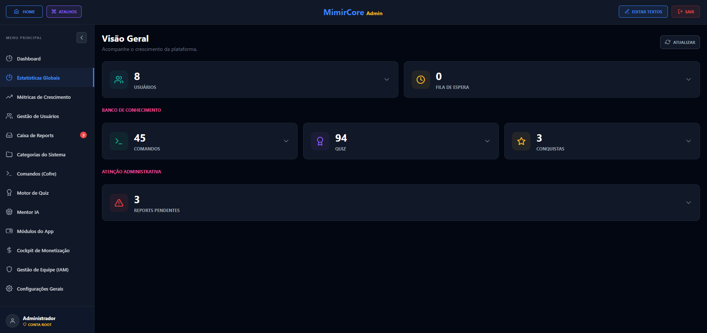

---

## Contato e Suporte

O MimirCore está em constante evolução. Os próximos refinamentos incluem novas integrações de IA e otimização das métricas do painel Admin. 

Se você encontrou algum bug, tem uma sugestão de nova funcionalidade ou quer falar sobre qualquer coisa sobre o app:

* **Linkedin:** https://www.linkedin.com/in/pedro-mosmann-a41466178/
* **Manual de Uso:** https://drive.google.com/file/d/1_DlYaJJrCqbKcSY-NO8F9-OzkxhSYtUv/view?usp=sharing
* **Avaliação do App, feedbacks e reports de bugs:** https://forms.gle/NRuhYvuLJ4Mot9DK9

Se a arquitetura ou o código te serviram de inspiração, não esqueça de deixar uma estrela no repositório!
